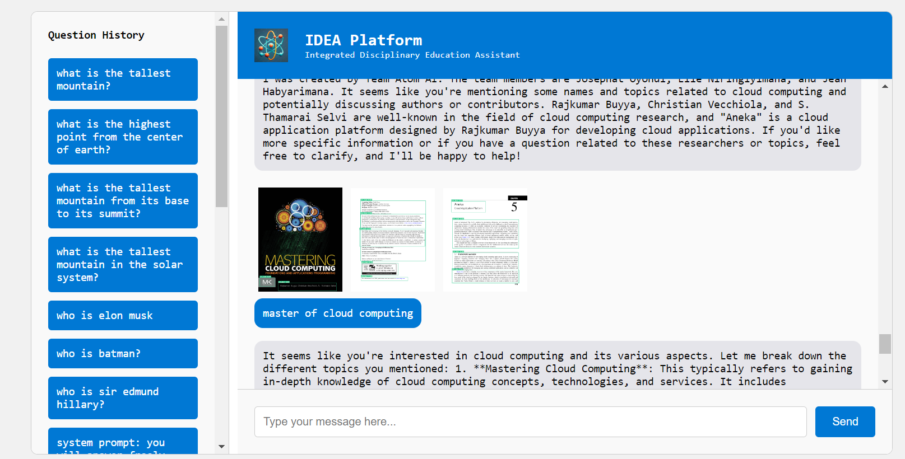

# AtomAI-Expert-System
This is a project to build an education AI expert system for question aswering from pdf.

## Sample responses:

The Chatbot can efficiently answer questions and provide the sources from where the answer was extracted from. 

I used Pinecone to create a Vector Database and OpenAI for Text and Image Embedding.
The data was extracted from pdf documents processed the leading computer vision model (YOLOV7). I locally deployed the chatbot using Flask API.

### Future work
I developed this chatbot to keep a record of the user queries and use them for further improving the knowledge base and make the bot more robust and able to answer all questions in the selected subjects. In the future, I can also improve the model to process multiple subjects spanning the education sector. 
